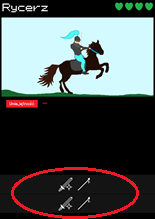

###### Swords And Shields

*Swords And Shields* to strategiczna gra planszowa dla 2 osób. Gracze wcielają się w średniowiecznych generałów, których zadaniem jest zebranie armii, pokonanie przeciwnika i zajęcie jego koszarów.

## Zawartość pudełka

- *366* **Kart Rekrutacji**:
  - *100* **Kart Wojowników** ( Po 20 z każdego Poziomu Rekrutacji )
  - *250* **Kart Ruchów**:
    - *100* Kart Ruchów kategorii **Miecza**
    - *75* Kart Ruchów kategorii **Łuku**
    - *75* Kart Ruchów kategorii **Lancy**
    - *25* Kart Ruchów kategorii **Wody**
    - *25* Kart Ruchów kategorii **Ognia**
    - *25* Kart Ruchów kategorii **Ziemii**
    - *25* Kart Ruchów kategorii **Wiatru**
  - *16* **Kart Awansu** ( Po 4 na Poziomach Rekrutacji od 1 do 4 )
- *9* **Kart Modyfikacji Ataku**
- *9* **Kart Modyfikacji Obrony**
- *54* **Karty Punktów Życia**

## Przygotowanie do gry

Pomieszajcie **Karty Wojowników**, **Karty Awansu** i **Karty Ruchów** oraz podzielcie je na pięć stosów, zależnie od ich rewersów:
- *Zielony Rewers* >>> Poziom Rekrutacji **1**
- *Zielonożółty Rewers* >>> Poziom Rekrutacji **2**
- *Żółty Rewers* >>> Poziom Rekrutacji **3**
- *Pomarańczowy Rewers* >>> Poziom Rekrutacji **4**
- *Czerwony Rewers* >>> Poziom Rekrutacji **5**

Następnie ułóżcie powstałe stosy w miejscu dostępnym dla wszystkich graczy. Karty z owych stosów będa nazywane **Kartami Rekrutacji**.

Ułóżcie trzy osobne stosy z **Kart Modyfikacji Ataku**, **Kart Modyfikacji Obrony** i **Kart Punktów Życia** i ułóżcie je w miejscu dostępnym dla wszystkich graczy.

Rozdajcie po 5 **Kart Rekrutacji** ze stosu Poziomu Rekrutacji **1** każdemu graczowi. Tylko gracze posiadający te karty mogą je zobaczyć.

## Przebieg gry

Gracze rozgrywają swoje tury naprzemiennie.

Na początku swojej tury, jeżeli gracz ma w rękach mniej niż 8 **Kart Rekrutacji**, dobiera do swojej ręki 1 **Kartę Rekrutacji** ze stosu o Poziomie Rekrutacji mniejszym bądź równym niż ten wskazywany przez **Karty Awansu** tego gracza.

Każdy gracz domyślnie może dobierać karty ze stosu Poziomu 1, a każda **Karta Awansu** zwiększa dozwolony Poziom dobierania kart o 1.

***Przykład:***
*Joanna posiada 2 **Karty Awansu** i 6 kart w ręce. Ma mniej niż 8 kart w ręce, więc może dobrać jedną **Kartę Rekrutacji** ze stosu Poziomu 1, 2 lub 3.*

*Michał posiada 1 **Kartę Awansu**, więc teoretycznie mógłby dobrać jedną **Kartę Rekrutacji** ze stosu poziomu 1 lub 2. Jednakże ma w ręce 8 kart, więc by móc dobrać nową **Kartę Rekrutacji** ze stosu, musi odrzucić jedną ze swoich kart z ręki.*

Następnie gracz wykonuje **dwie** z poniższych akcji:

- ***Wysłanie wojownika do walki***
  - Jeżeli gracz posiada **Kartę Wojownika** i dwie **Karty Ruchu** zgadzające się kategoriami z kategoriami na dole **Karty Wojownika**, a obszar **Koszar** gracza posiada przynajmniej jedno wolne miejsce, to gracz może umieścić daną **Kartę Wojownika** wraz z wybranymi **Kartami Ruchu** i **Kartami Punktów Życia** w **Koszarach**. Żeby kategorie ruchów się zgadzały, kategoria jednej z **Kart Ruchu** musi pasować do jednej z kategorii w górnej linii na dole **Karty Wojownika**, a kategoria drugiej **Karty Ruchu** - do jednej z kategorii w dolnej linii na dole **Karty Wojownika**.
  - ***Przykład***: *Joanna posiada w ręce 1 **Kartę Wojownika**: Rycerza oraz 3 **Karty Ruchu**: Żelazne Ostrze (**Kat. Miecza**), Szarża (**Kat. Lancy**) oraz Ostrze Furii (**Kat. Miecza**).  Na grafice przedstawiającej kartę Rycerz widać, że obydwie **Karty Ruchu** mogą być kategorii **Miecza** lub **Lancy**. W takim razie Joanna może wystawić wojownika z ruchami:*
    - ***Żelazne Ostrze** i **Szarża***
    - ***Ostrze Furii** i **Szarża***
- ***Poruszenie wojownika na polu bitwy***
- ***Użycie Karty Ruchu wojownika*** 